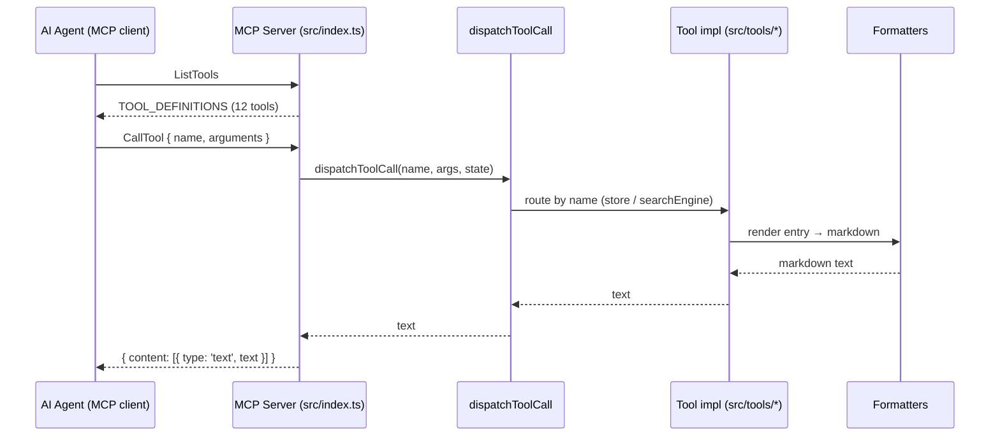

# API Design — MCP Tools

> **Last Updated**: 2026-06-04

## API Style

The server's public contract is its set of **MCP tools**, not an HTTP/REST API.
A connected MCP client (an AI agent) discovers tools via the protocol's
`ListTools` request and invokes them via `CallTool`. Each tool:

- has a `name`, an LLM-facing `description`, and a JSON-Schema `inputSchema`;
- is dispatched by `dispatchToolCall` in `src/server.ts`;
- returns a **single markdown text result** rendered by the formatters.

The canonical manifest lives in `TOOL_DEFINITIONS` (`src/server.ts`). The tools
are grouped into **core** (6), **intelligence** (4), and **utility** (2).

## Transport & Conventions

- **Transport**: stdio (`StdioServerTransport`). stdout carries the MCP
  protocol; all logging goes to stderr.
- **Result shape**: `{ content: [{ type: 'text', text: <markdown> }] }`; errors
  return the same shape with `isError: true`.
- **Error handling**: an unknown tool name throws `Unknown tool: <name>`; tool
  exceptions are caught in `src/index.ts` and surfaced as an error result.
- **Statefulness**: tools read from a shared, mutable `ServerState` (store +
  search engine), so a `reindex` swap is immediately visible to later calls.

## Core Tools (6)

| Tool | Required args | Optional args | Purpose |
|------|---------------|---------------|---------|
| `query_component` | `componentName` | — | Full docs for a component (partial-name match), incl. props, examples, usage |
| `search_docs` | `query` | `module` (foundation/components/patterns/enterprise), `limit` | Full-text TF-IDF search with ranked excerpts |
| `list_by_category` | `category` | — | List components in a category (buttons, forms, navigation, data-display, feedback, overlays, layout, utilities) |
| `get_foundation` | — | `topic` (getting-started, fluent-provider, theming, styling-griffel, component-architecture, accessibility) | Foundation docs; omit topic for overview |
| `get_pattern` | `patternCategory` | `patternName` | UI patterns (composition, data, forms, layout, modals, navigation, state) |
| `get_enterprise` | `topic` | — | Enterprise patterns (app-shell, dashboard, admin, data, accessibility) |

## Intelligence Tools (4)

| Tool | Required args | Purpose |
|------|---------------|---------|
| `get_component_examples` | `componentName` | Extract labeled, ready-to-use code snippets for a component |
| `get_props_reference` | `componentName` | Structured props/slots table (types, defaults, descriptions) |
| `suggest_components` | `uiDescription` | Rank components for a described UI scenario |
| `get_implementation_guide` | `goal` | Step-by-step guide: component suggestions, imports, patterns, a11y checklist |

## Utility Tools (2)

| Tool | Args | Purpose |
|------|------|---------|
| `list_all_docs` | — | List all indexed docs grouped by module/category |
| `reindex` | `force` (boolean, optional) | Rebuild the index by reloading the schema from disk |

## Request Flow

## Adding or Changing a Tool

1. Implement the tool in `src/tools/<tool-name>.ts` (one file per tool).
2. Add its definition to `TOOL_DEFINITIONS` and a `case` to `dispatchToolCall`
   in `src/server.ts`.
3. Add the argument type to `src/types/index.ts`.
4. Add tests under `src/__tests__/tools/`.
5. Run the verify step (`yarn build && yarn test`) before committing.

Because the tool list is the public contract, treat additions as additive and
avoid breaking existing names/argument shapes without a deliberate decision
(record it as an ADR).
