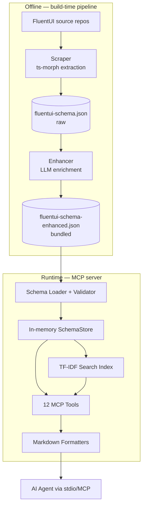

# fluentui-mcp — Technical Architecture

> **Project**: fluentui-mcp
> **Type**: Library / CLI (MCP server)
> **Tech Stack**: TypeScript (ESM), Node.js ≥18, MCP SDK, Vitest, ts-morph
> **Last Updated**: 2026-06-04

---

## System Purpose

`fluentui-mcp` is a [Model Context Protocol](https://modelcontextprotocol.io/)
server that gives AI assistants intelligent, context-efficient access to
Microsoft **FluentUI v9** documentation. Instead of forcing an agent to crawl
raw documentation, it exposes **12 specialized tools** (query a component,
search docs, suggest components, generate an implementation guide, and more)
backed by a single, pre-built, LLM-enhanced JSON schema served from memory.

The runtime is deliberately lightweight: it ships one production dependency
(`@modelcontextprotocol/sdk`), loads a bundled schema file at startup, builds an
in-memory store plus a TF-IDF search index, and answers tool calls over a stdio
transport. All of the expensive work — scraping FluentUI source and enriching
it with an LLM — happens **offline at build time**, never at runtime.

This documentation is for developers who will maintain or extend the server, the
schema pipeline, or the toolset. It is **not** end-user product documentation.

## Architecture at a Glance

## Key Components

| Component | Location | Purpose |
|-----------|----------|---------|
| Scraper | `scripts/scraper/` | Extract props/slots/stories/utilities from FluentUI source via ts-morph |
| Enhancer | `scripts/enhancer/` | Enrich the raw schema with LLM-generated descriptions, guides, and patterns |
| Schema subsystem | `src/schema/` | Loader, in-memory store, and lenient validator |
| Search | `src/search/` | TF-IDF search engine + index builder |
| Formatters | `src/formatters/` | Render schema entries to markdown for tool output |
| Tools | `src/tools/` | The 12 MCP tools (one file per tool) |
| Server core | `src/server.ts` | Tool manifest, state factory, dispatcher |
| Entry point | `src/index.ts` | Process/stdio-transport wiring |

## Technology Decisions

See the [Architecture Decision Records](/decisions/) for the rationale behind
the schema-as-source-of-truth design, the bundled enhanced JSON, the LLM
provider model-family handling, and the in-memory TF-IDF search.

## Getting Started

New to the project? Start with the [Getting Started Guide](/guides/getting-started),
then read the [System Overview](/architecture/system-overview) to understand how
the pieces fit together.
