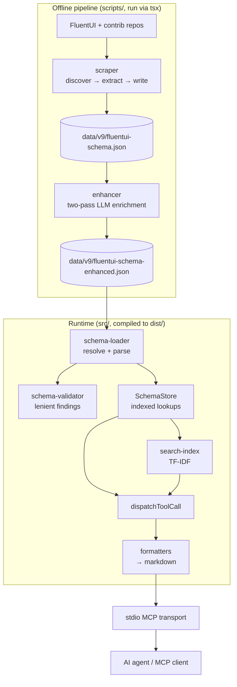

# System Overview

> **Last Updated**: 2026-06-04

## Architecture Style

`fluentui-mcp` is a **single-process, schema-driven MCP server** with a strict
split between an **offline build-time pipeline** and a **lightweight runtime**.

The guiding principle: do all expensive, non-deterministic work (source
scraping, LLM enrichment) ahead of time, bake the result into a single bundled
JSON file, and make the runtime a fast, dependency-light reader of that file.
This keeps the published npm package small, deterministic, and free of any
network or API-key requirements at runtime.

## Component Architecture

## Component Responsibilities

### Scraper (`scripts/scraper/`)

- **Purpose**: Extract a structured raw schema (components, props, slots,
  default values, stories, and utility exports) from FluentUI source.
- **Technology**: `ts-morph` static analysis over a sparse/shallow checkout of
  `microsoft/fluentui` (and optionally `microsoft/fluentui-contrib`).
- **Inputs**: A local checkout (`--source`) or a freshly cloned repo (`--clone`),
  plus a version config (`v9`).
- **Outputs**: `data/<version>/fluentui-schema.json` (raw schema) with source
  metadata (repo, ref, commit, scrapedAt).
- **Key modules**: `discover.ts` (find packages), `adapters/v9-adapter.ts`
  (version-specific extraction), `extractors/*` (props/slots/stories/defaults/
  utility), `classify.ts` (component vs utility vs internal), `output.ts`.

### Enhancer (`scripts/enhancer/`)

- **Purpose**: Enrich the raw schema with LLM-generated content — component
  descriptions, prop guidance, anti-patterns, edge cases, performance/theming
  notes, composition examples, plus foundation/pattern/enterprise guides and
  quick-reference material.
- **Technology**: Native `fetch`-based LLM providers (OpenAI / Anthropic, zero
  extra deps) with a `MockLLMProvider` for tests; concurrency-limited batching.
- **Inputs**: The raw schema, the previous enhanced schema (for diff-based
  incremental enhancement), and provider config from env vars.
- **Outputs**: `data/<version>/fluentui-schema-enhanced.json`, the **single
  source of truth served at runtime**. Every write is validated; the CLI exits
  non-zero on any validation error.
- **Key modules**: `enhancer.ts` (orchestrator), `llm/*` (providers, batching,
  model ceilings), `prompts/*` (per-content-type prompt builders), `diff.ts` +
  `hasher.ts` + `merge.ts` (incremental enhancement).

### Schema subsystem (`src/schema/`)

- **`schema-loader.ts`**: Resolves the schema path (explicit → `FLUENTUI_SCHEMA_PATH`
  env → bundled `data/<version>/`), reads and JSON-parses it (throws on I/O or
  parse errors), and runs validation. Strict I/O, lenient content.
- **`schema-validator.ts`**: Produces `ValidationError[]` with `error`/`warning`
  severities; never throws on content issues (the server decides how to react).
- **`schema-store.ts`**: Builds in-memory indexes for fast lookup by component
  name, category, etc. — the read model every tool queries.

### Search (`src/search/`)

- **`search-index.ts`**: Builds a TF-IDF index from the store at startup.
- **`search-engine.ts`**: Ranks documents for `search_docs` and powers
  `suggest_components` / `get_implementation_guide` relevance scoring.

### Formatters (`src/formatters/`)

- Render schema entries into markdown for tool responses
  (`component-formatter`, `props-formatter`, `story-formatter`,
  `guide-formatter`, `pattern-formatter`, `list-formatter`).
- **Additive rendering rule**: every enrichment field is optional; a formatter
  renders a section **only when its field is present**, preserving
  back-compatibility with un-enhanced schemas.

### Server core (`src/server.ts`) & entry point (`src/index.ts`)

- `TOOL_DEFINITIONS`: the JSON-Schema manifest of all 12 tools sent to clients.
- `createServerState(schemaPath?)`: loads schema → builds store + search index;
  returns state plus a validation-finding count.
- `dispatchToolCall(name, args, state)`: routes a tool call to its
  implementation, reading the live store/engine so a `reindex` swap is visible.
- `src/index.ts`: resolves config, creates the MCP `Server`, registers the
  ListTools and CallTool handlers, and connects over a `StdioServerTransport`.
  Startup logs go to **stderr** (stdout is reserved for the MCP protocol).

## Communication Patterns

| From | To | Protocol | Pattern | Notes |
|------|-----|----------|---------|-------|
| MCP client (agent) | Server | MCP over stdio | Request/response | One tool call → one markdown text result |
| Pipeline | Runtime | Filesystem (bundled JSON) | Build-time artifact | No live coupling; runtime only reads `data/` |
| Enhancer | LLM provider | HTTPS (`fetch`) | Concurrency-limited batch | Offline only; never at server runtime |

## Cross-Cutting Concerns

- **Determinism**: Runtime behavior depends only on the bundled JSON; no network
  calls, no API keys.
- **Validation**: Schema content is validated both when the enhancer writes it
  (hard fail on errors) and when the server loads it (findings reported, not
  fatal by default).
- **Logging**: Server diagnostics go to stderr to keep stdout clean for MCP.
- **Versioning**: The schema path is version-scoped (`data/<version>/`),
  allowing future v8/v10 schemas to coexist.
- **Testing**: Vitest suite covers scraper, enhancer, schema, search,
  formatters, tools, and an end-to-end pipeline test.
